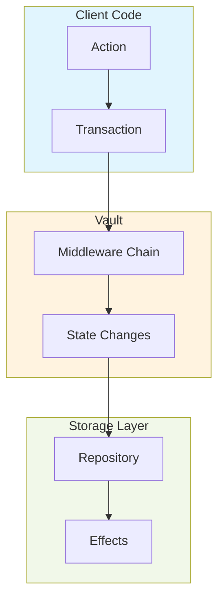
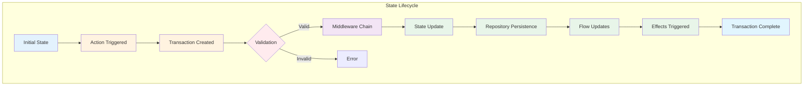
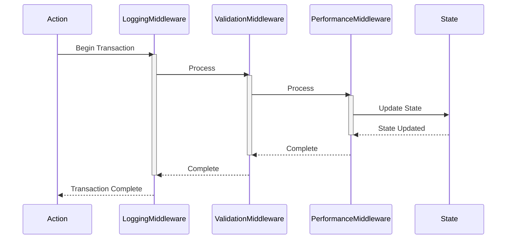

# Vault: Type-safe State Management for Kotlin

## Table of Contents
- [Overview](#overview)
- [Core Concepts](#core-concepts)
- [Architecture](#architecture)
- [Getting Started](#getting-started)
- [Advanced Features](#advanced-features)
- [Best Practices](#best-practices)
- [API Reference](#api-reference)
- [Performance Considerations](#performance-considerations)
- [Troubleshooting](#troubleshooting)

## Overview

Vault is a modern state management library for Kotlin applications that combines type safety with powerful reactive features. Built on Kotlin coroutines and Flow, it provides a robust foundation for managing complex application state with confidence.

### Key Features

| Feature | Description | Benefits |
|---------|-------------|-----------|
| 🔒 Type Safety | Complete compile-time type checking | Catch errors early, improve refactoring confidence |
| ⚡ High Performance | Object pooling and coroutines | Efficient memory usage, responsive applications |
| 🔄 Reactive Updates | Built on Kotlin Flow | Real-time updates, declarative data flow |
| 🛡️ Transactions | Atomic state changes | Data consistency, easy rollbacks |
| 🔌 Middleware | Extensible pipeline | Logging, monitoring, validation |
| 🎯 Effects | Side-effect management | Clean architecture, predictable behavior |
| 📊 Debugging | Comprehensive logging | Easy troubleshooting |
| 🧪 Testing | First-class testing support | Reliable code, confident releases |

## Core Concepts

### Architecture Overview



### State Lifecycle



### Middleware Chain



## Getting Started

### Installation

Add Vault to your project:

```kotlin
// build.gradle.kts
dependencies {
    implementation("com.vynatix:vault:1.0.0")
}
```

### Basic Usage

1. Define your state container:

```kotlin
class UserVault : Vault<UserVault>() {
    // States are declared using property delegation
    val username by state { "guest" }
    val isLoggedIn by state { false }
    val profile by state { UserProfile() }
    
    // Custom data classes can be used as states
    data class UserProfile(
        val firstName: String = "",
        val lastName: String = "",
        val email: String = ""
    )
}
```

2. Create actions for state modifications:

```kotlin
class LoginAction(
    private val username: String,
    private val profile: UserVault.UserProfile
) : Action<UserVault> {
    override fun invoke(vault: UserVault) = vault {
        // Multiple state changes in a single transaction
        username mutate username
        profile mutate profile
        isLoggedIn mutate true
    }
}
```

3. Set up repositories for persistence:

```kotlin
class UserRepository : Repository<String> {
    private val _dataFlow = MutableStateFlow("guest")
    
    override fun set(value: String): Boolean {
        // Validate and persist state changes
        if (value.isBlank()) return false
        _dataFlow.value = value
        return true
    }
    
    override fun flow(): SharedFlow<String> = _dataFlow.asSharedFlow()
}
```

4. Configure middleware for cross-cutting concerns:

```kotlin
class ValidationMiddleware<T : Vault<T>> : Middleware<T>() {
    override fun onTransactionStarted(context: MiddlewareContext<T>) {
        // Perform validation before state changes
        context.transaction.modifiedProperties.forEach { state ->
            validateState(state, context)
        }
    }
    
    private fun validateState(state: State<*>, context: MiddlewareContext<T>) {
        // Custom validation logic
        when (state()) {
            is String -> require(state().toString().isNotBlank())
            is Number -> require(state().toString().toInt() >= 0)
        }
    }
}
```

5. Add effects for reactive updates:

```kotlin
userVault {
    // React to state changes
    username effect { newUsername ->
        println("Username changed to: $newUsername")
    }
    
    isLoggedIn effect { loggedIn ->
        if (!loggedIn) {
            // Clear sensitive data on logout
            username mutate "guest"
            profile mutate UserVault.UserProfile()
        }
    }
}
```

## Advanced Features

### Transaction Management

Transactions ensure atomic state updates:

```kotlin
class ComplexAction : Action<UserVault> {
    override fun invoke(vault: UserVault) = vault {
        try {
            // All changes succeed or none do
            profile mutate fetchUserProfile()
            preferences mutate loadPreferences()
            settings mutate initializeSettings()
        } catch (e: Exception) {
            // Transaction automatically rolls back
            throw e
        }
    }
}
```

### Custom Middleware

Create specialized middleware for your needs:

```kotlin
class AnalyticsMiddleware<T : Vault<T>> : Middleware<T>() {
    override fun onTransactionCompleted(context: MiddlewareContext<T>) {
        val metrics = context.transaction.modifiedProperties.map { state ->
            val propertyName = context.vault.properties
                .entries
                .find { it.value == state }
                ?.key
            
            MetricEvent(
                property = propertyName ?: "unknown",
                oldValue = context.transaction.previousValues[state],
                newValue = state()
            )
        }
        
        trackMetrics(metrics)
    }
}
```

### State Validation

Implement custom validation in repositories:

```kotlin
class EmailRepository : Repository<String> {
    override fun set(value: String): Boolean {
        return when {
            !value.contains("@") -> false
            !value.contains(".") -> false
            value.length < 5 -> false
            else -> true.also { _dataFlow.value = value }
        }
    }
}
```

## Performance Considerations

### Object Pooling

Vault uses object pooling for efficient memory usage:

```kotlin
// Custom object pool for frequently created objects
class TransactionPool<T : Transaction> {
    private val pool = ObjectPool(
        factory = { Transaction() },
        reset = { it.clear() }
    )

    suspend fun acquire(): T = pool.acquire()
    suspend fun release(item: T) = pool.release(item)
}
```

### State Updates

Optimize state updates for performance:

```kotlin
class BatchUpdateAction : Action<UserVault> {
    override fun invoke(vault: UserVault) = vault {
        // Batch multiple updates in a single transaction
        val updates = fetchBatchUpdates()
        updates.forEach { (key, value) ->
            when (key) {
                "username" -> username mutate value
                "profile" -> profile mutate value
                // ... more cases
            }
        }
    }
}
```

## Best Practices

### State Organization

Group related states together:

```kotlin
class AppVault : Vault<AppVault>() {
    // User-related states
    val user by state { UserState() }
    
    // UI-related states
    val ui by state { UIState() }
    
    // Feature-specific states
    val feature by state { FeatureState() }
    
    data class UserState(
        val profile: UserProfile = UserProfile(),
        val preferences: UserPreferences = UserPreferences()
    )
    
    data class UIState(
        val theme: Theme = Theme.LIGHT,
        val language: String = "en"
    )
    
    data class FeatureState(
        val isEnabled: Boolean = false,
        val configuration: Map<String, Any> = emptyMap()
    )
}
```

### Error Handling

Implement comprehensive error handling:

```kotlin
when (val result = vault action LoginAction()) {
    is TransactionResult.Success -> {
        // Access transaction details
        val modified = result.transaction.modifiedProperties
        val previous = result.transaction.previousValues
        handleSuccess(modified, previous)
    }
    is TransactionResult.Error -> {
        when (val error = result.exception) {
            is ValidationException -> handleValidationError(error)
            is RepositoryException -> handleRepositoryError(error)
            else -> handleUnexpectedError(error)
        }
    }
}
```

## Testing

### Test Repositories

Create test-specific repositories:

```kotlin
class TestRepository<T : Any>(initialValue: T) : Repository<T> {
    private val _flow = MutableStateFlow(initialValue)
    private val updates = mutableListOf<T>()
    
    override fun flow() = _flow.asSharedFlow()
    
    override fun set(value: T) = true.also {
        _flow.value = value
        updates.add(value)
    }
    
    fun getUpdates(): List<T> = updates.toList()
}
```

### Test Middleware

Track state changes in tests:

```kotlin
class TestMiddleware<T : Vault<T>> : Middleware<T>() {
    private val _transactions = mutableListOf<Transaction>()
    val transactions: List<Transaction> get() = _transactions
    
    override fun onTransactionCompleted(context: MiddlewareContext<T>) {
        _transactions.add(context.transaction)
    }
}
```

## Troubleshooting

### Common Issues

1. State mutations outside transactions:
```kotlin
// ❌ Wrong: Direct state mutation
userVault.username.set("john")

// ✅ Correct: Mutation within transaction
vault action UpdateUsernameAction("john")
```

2. Missing repository initialization:
```kotlin
// ❌ Wrong: Accessing state without repository
val username = userVault.username()

// ✅ Correct: Initialize repository first
userVault {
    username repository UserRepository()
}
```

3. Middleware ordering issues:
```kotlin
// ❌ Wrong: Incorrect middleware order
vault.middlewares(
    AnalyticsMiddleware(),  // Depends on validation
    ValidationMiddleware()
)

// ✅ Correct: Proper middleware order
vault.middlewares(
    ValidationMiddleware(),  // Validates first
    AnalyticsMiddleware()   // Tracks validated changes
)
```

### Debugging Tips

Enable detailed logging:

```kotlin
val loggingMiddleware = LoggingMiddleware<UserVault>(
    options = LoggingMiddleware.Options(
        logLevel = LogLevel.DEBUG,
        includeStackTrace = true,
        includeStateValues = true,
        formatter = CustomLogFormatter()
    )
)
```

## License

Apache 2.0 License